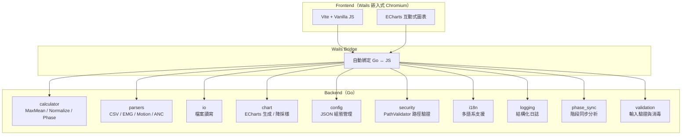
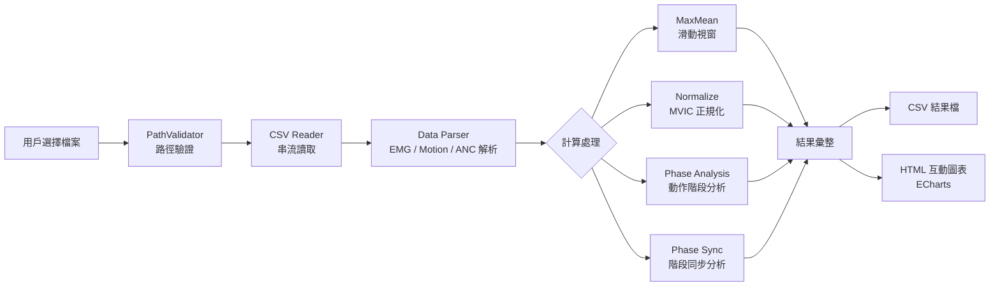
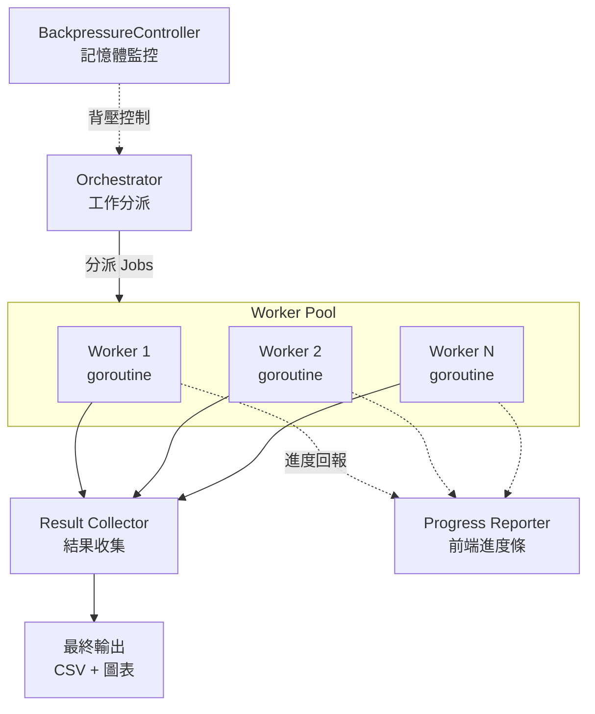

# count_mean — EMG 生物訊號分析工具

[](https://golang.org/)
[](LICENSE)
[](https://github.com/littlebluewhite/count_mean)

> 基於 Go + Wails 的跨平台桌面應用，供運動科學研究者與復健治療師批量分析肌電圖（EMG）生物訊號。透過 Worker Pool 並行運算模型高效處理 1GB+ 大型資料集，產出 CSV 報表與 ECharts 互動式圖表。

## 技術棧

| 層級 | 技術 |
|------|------|
| 語言 | Go 1.25 |
| 桌面框架 | Wails v2（嵌入式 Chromium） |
| 前端 | Vite 7 + Vanilla JS |
| 圖表 | go-echarts v2（ECharts） |
| Excel | excelize v2 |
| 測試 | testify + Go benchmark |
| Lint | golangci-lint（45+ linters） |
| CI/CD | GitHub Actions |

## 系統架構圖



## 資料處理流程



## 並行運算模型（Worker Pool）



## 核心功能

### MaxMean 滑動視窗計算

對 EMG 訊號執行滑動視窗統計，在指定時間窗內找出最大平均值區間。支援可配置的視窗大小與步進參數，適用於肌肉出力峰值偵測。

### MVIC 正規化

以最大自主等長收縮（Maximum Voluntary Isometric Contraction）為基準，將原始 EMG 振幅正規化為 %MVIC。配置化的縮放因子（scaling factor: 10）與精度（precision: 10）確保數據一致性。

### 動作階段分析

自動辨識生物力學動作的四個階段：
1. **啟跳下蹲階段**（Squat Phase）
2. **啟跳上升階段**（Ascending Phase）
3. **團身階段**（Body Tuck Phase）
4. **下降階段**（Descent Phase）

### 階段同步分析

跨多個感測器通道的階段時序對齊，分析不同肌群在同一動作階段中的協調模式。

### 互動式圖表（ECharts）

透過 go-echarts 生成 HTML 互動圖表，支援 zoom、tooltip、多通道疊加顯示。針對大數據集自動執行降採樣（downsampling），確保瀏覽器渲染效能。

### 大檔串流處理（1GB+）

採用串流式 CSV 讀取搭配 Worker Pool 並行運算，BackpressureController 動態監控記憶體用量，避免 OOM。即使面對 GB 等級的資料集也能穩定處理。

## 安裝與使用

### 快速開始

```bash
git clone https://github.com/littlebluewhite/count_mean.git
cd count_mean
go mod download
```

### 開發環境設定

```bash
make dev-setup              # 安裝所有開發工具（golangci-lint, gosec, wails）
```

### 運行

```bash
go run main.go              # 運行 GUI 應用
go run main.go -cli         # 運行 CLI 模式
```

### 建置

```bash
make build                  # 當前平台
make build-wails            # 完整 Wails 建置（含前端 npm build）
make build-cross            # 所有平台（linux/windows/darwin, amd64/arm64）
```

### 配置設定

編輯 `config.json` 自定義設定：

```json
{
  "scalingFactor": 10,
  "precision": 10,
  "language": "zh-TW",
  "logLevel": "info",
  "logFormat": "text",
  "inputDir": "./input",
  "outputDir": "./output"
}
```

## 專案架構

```
count_mean/
├── main.go                    # 主程序入口
├── gui/                       # Wails GUI 應用
├── internal/                  # 內部套件
│   ├── calculator/           # MaxMean / Normalizer / PhaseAnalyzer
│   ├── parsers/              # CSV / EMG / Motion / ANC 統一解析器
│   ├── io/                   # CSVHandler（BOM）/ LargeFileHandler（串流）
│   ├── models/               # EMGData / EMGDataset / MaxMeanResult
│   ├── chart/                # go-echarts 圖表生成與降採樣
│   ├── config/               # JSON 組態管理
│   ├── i18n/                 # 多語系（zh-TW, zh-CN, en-US, ja-JP）
│   ├── logging/              # 結構化日誌
│   ├── phase_sync/           # 階段同步分析
│   └── validation/           # 輸入驗證與消毒
├── util/                      # 共用工具子套件
│   ├── csvutil/              # BOM 處理、CSV cell 防 formula-injection sanitize
│   └── fsperm/               # FilePerm/DirPerm 與 OpenFile flags（含 O_NOFOLLOW）
├── frontend/                  # Vite + Vanilla JS 前端
├── test/                      # 測試目錄
│   ├── unit/                 # 單元測試
│   ├── integration/          # 整合測試
│   ├── benchmark/            # 效能基準測試
│   └── testdata/             # 測試資料
├── docs/                      # 文檔
│   ├── api.md
│   ├── architecture.md
│   ├── usage.md
│   └── testing_automation.md
└── config.json               # 應用配置
```

## 測試與品質

### 運行測試

```bash
make test                   # 所有測試（單元 + 整合）
make test-unit              # 僅單元測試
make test-int               # 僅整合測試
make test-race              # 競態條件檢測
```

### 效能基準測試

```bash
make bench                  # 自定義基準測試
make bench-std              # 標準 Go 基準測試（含記憶體統計）
```

### 測試覆蓋

```bash
make coverage               # 完整覆蓋率分析
make coverage-html          # 產生 HTML 報告
```

### 程式碼品質

```bash
make lint                   # golangci-lint（45+ linters）
make lint-fix               # 自動修正 lint 問題
make format                 # gofmt + goimports
make ci                     # 完整 CI：test, bench, coverage, lint, security
```

## 工程品質

| 指標 | 數據 |
|------|------|
| 程式碼規模 | ~11,600 LOC / 106 Go 檔 |
| 測試覆蓋 | 37 個測試檔、目標 90% coverage |
| 程式碼品質 | golangci-lint 嚴格規範（45+ linters、cyclomatic complexity ≤ 15） |
| 安全防護 | PathValidator 路徑遍歷攻擊防禦 + gosec 掃描 |
| 多語系 | 4 國語系（zh-TW, zh-CN, en-US, ja-JP） |
| 跨平台 | Linux / Windows / macOS（Intel + Apple Silicon） |
| CI/CD | GitHub Actions 自動建置 + 發布 |

## 國際化支持

支持 4 國語系界面：
- 繁體中文 (zh-TW)
- 簡體中文 (zh-CN)
- 英文 (en-US)
- 日文 (ja-JP)

在 `config.json` 中設定 `language` 參數即可切換語言。

## 文檔

- [API 參考](docs/api.md)
- [架構說明](docs/architecture.md)
- [使用指南](docs/usage.md)
- [測試自動化](docs/testing_automation.md)

## 授權條款

本專案使用 MIT 授權條款。詳情請參閱 [LICENSE](LICENSE) 文件。

---

**GitHub：** https://github.com/littlebluewhite/count_mean
